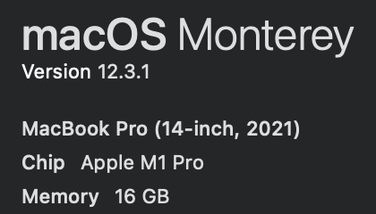

### Subject of the issue

The project which depends on `ic-agent` is unable to compile for the m1 chip MacBook.

### Environment



### Step to reproduce

```rust
cargo build
```

### Expected behaviour

compiled successfully

### Actual behaviour

```
error: linking with `cc` failed: exit status: 1
  |
  = note: "cc" "-arch" "arm64" "/Users/allen/ic-agent-bug-report/target/debug/deps/ic_agent_compiler_test-25dc0898d7f30739.111z3532tp85lokg.rcgu.o" "/Users/allen/ic-agent-bug-report/target/debug/deps/ic_agent_compiler_test-25dc0898d7f30739.28ng85a3cckysb7n.rcgu.o" "/Users/allen/ic-agent-bug-report/target/debug/deps/ic_agent_compiler_test-25dc0898d7f30739.3fjtdfj8rgrimj63.rcgu.o" "/Users/allen/ic-agent-bug-report/target/debug/deps/ic_agent_compiler_test-25dc0898d7f30739.42rumefwueo63vm5.rcgu.o" "/Users/allen/ic-agent-bug-report/target/debug/deps/ic_agent_compiler_test-25dc0898d7f30739.4doj38kzlm3wrn43.rcgu.o" "/Users/allen/ic-agent-bug-report/target/debug/deps/ic_agent_compiler_test-25dc0898d7f30739.4gxcnlq8wvnzgq82.rcgu.o" "/Users/allen/ic-agent-bug-report/target/debug/deps/ic_agent_compiler_test-25dc0898d7f30739.59bobkkdx7bbitub.rcgu.o" "/Users/allen/ic-agent-bug-report/target/debug/deps/ic_agent_compiler_test-25dc0898d7f30739.n527geq1cqezf1b.rcgu.o" "-L" "/Users/allen/ic-agent-bug-report/target/debug/deps" "-L" "/Users/allen/ic-agent-bug-report/target/debug/build/ring-0d6d682d3e73b0f5/out" "-L" "/Users/allen/.rustup/toolchains/stable-aarch64-apple-darwin/lib/rustlib/aarch64-apple-darwin/lib" "/Users/allen/ic-agent-bug-report/target/debug/deps/libic_agent-e63d47d2d24264f7.rlib" "/Users/allen/ic-agent-bug-report/target/debug/deps/libpem-1745fd7e541a5061.rlib" "/Users/allen/ic-agent-bug-report/target/debug/deps/libserde_cbor-53b3aebeaff6170d.rlib" "/Users/allen/ic-agent-bug-report/target/debug/deps/libhalf-254ef16163bd2bf2.rlib" "/Users/allen/ic-agent-bug-report/target/debug/deps/libic_types-ec15e1cd63e75b7b.rlib" "/Users/allen/ic-agent-bug-report/target/debug/deps/libcrc32fast-3609ed17385e5674.rlib" "/Users/allen/ic-agent-bug-report/target/debug/deps/libbase32-a20fd3c0b94e20d5.rlib" "/Users/allen/ic-agent-bug-report/target/debug/deps/libserde_bytes-4c1c823fc95484d9.rlib" "/Users/allen/ic-agent-bug-report/target/debug/deps/libhex-1feb2dd513981902.rlib" "/Users/allen/ic-agent-bug-report/target/debug/deps/libsha2-63fd82d5a955a763.rlib" "/Users/allen/ic-agent-bug-report/target/debug/deps/libdigest-be3e9fa2991757b2.rlib" "/Users/allen/ic-agent-bug-report/target/debug/deps/libblock_buffer-44c5f39f5be7c55e.rlib" "/Users/allen/ic-agent-bug-report/target/debug/deps/libcrypto_common-24c0fc7c12b06f8a.rlib" "/Users/allen/ic-agent-bug-report/target/debug/deps/libk256-941d6b2a04508fec.rlib" "/Users/allen/ic-agent-bug-report/target/debug/deps/libsha2-9d90471073cddd41.rlib" "/Users/allen/ic-agent-bug-report/target/debug/deps/libopaque_debug-67f3deef4a02681c.rlib" "/Users/allen/ic-agent-bug-report/target/debug/deps/libblock_buffer-7d6184a327b99269.rlib" "/Users/allen/ic-agent-bug-report/target/debug/deps/libecdsa-eca569d8bbdf359d.rlib" "/Users/allen/ic-agent-bug-report/target/debug/deps/librfc6979-9d376d9a377eb926.rlib" "/Users/allen/ic-agent-bug-report/target/debug/deps/libhmac-e5c168f7c9b5be60.rlib" "/Users/allen/ic-agent-bug-report/target/debug/deps/libcrypto_mac-566c934f0ad36e80.rlib" "/Users/allen/ic-agent-bug-report/target/debug/deps/libsignature-f8f375797fccbbc2.rlib" "/Users/allen/ic-agent-bug-report/target/debug/deps/libdigest-cf3c5824872bb3e2.rlib" "/Users/allen/ic-agent-bug-report/target/debug/deps/libelliptic_curve-f7120a91d58aede9.rlib" "/Users/allen/ic-agent-bug-report/target/debug/deps/libbase16ct-bf83d089cd9ef7c7.rlib" "/Users/allen/ic-agent-bug-report/target/debug/deps/libsec1-17958739ec9f664f.rlib" "/Users/allen/ic-agent-bug-report/target/debug/deps/libpkcs8-a7e27b913f3555fc.rlib" "/Users/allen/ic-agent-bug-report/target/debug/deps/libspki-f6aa4ccb2e64e0c4.rlib" "/Users/allen/ic-agent-bug-report/target/debug/deps/libder-b7e664ca777d6219.rlib" "/Users/allen/ic-agent-bug-report/target/debug/deps/libpem_rfc7468-926f63975de2d623.rlib" "/Users/allen/ic-agent-bug-report/target/debug/deps/libbase64ct-f04bcdc2ea65f5b2.rlib" "/Users/allen/ic-agent-bug-report/target/debug/deps/libconst_oid-56e2aa0af92d471f.rlib" "/Users/allen/ic-agent-bug-report/target/debug/deps/libgroup-40104be5be33928d.rlib" "/Users/allen/ic-agent-bug-report/target/debug/deps/libff-70cbff00bdd2b952.rlib" "/Users/allen/ic-agent-bug-report/target/debug/deps/libcrypto_bigint-69a5014d54675965.rlib" "/Users/allen/ic-agent-bug-report/target/debug/deps/libzeroize-6ae2d925e409cfb0.rlib" "/Users/allen/ic-agent-bug-report/target/debug/deps/libsubtle-e36afb7afeb23781.rlib" "/Users/allen/ic-agent-bug-report/target/debug/deps/libgeneric_array-57af65c6d6664f5f.rlib" "/Users/allen/ic-agent-bug-report/target/debug/deps/libtypenum-275e5de2b40a0b6b.rlib" "/Users/allen/ic-agent-bug-report/target/debug/deps/libsimple_asn1-b74ae964d9e69be3.rlib" "/Users/allen/ic-agent-bug-report/target/debug/deps/libtime-9c3173e70550007c.rlib" "/Users/allen/ic-agent-bug-report/target/debug/deps/libquickcheck-8db2297a159122fc.rlib" "/Users/allen/ic-agent-bug-report/target/debug/deps/libnum_bigint-efae12e42b3abe28.rlib" "/Users/allen/ic-agent-bug-report/target/debug/deps/libnum_integer-2873197ca3b60acf.rlib" "/Users/allen/ic-agent-bug-report/target/debug/deps/libnum_traits-c5f097b9add9789b.rlib" "/Users/allen/ic-agent-bug-report/target/debug/deps/libgarcon-4b8cab0bb7de6134.rlib" "/Users/allen/ic-agent-bug-report/target/debug/deps/librand-d15ea1e102688849.rlib" "/Users/allen/ic-agent-bug-report/target/debug/deps/librand_chacha-b92e99cca5d28f6b.rlib" "/Users/allen/ic-agent-bug-report/target/debug/deps/libppv_lite86-dd32967015441a76.rlib" "/Users/allen/ic-agent-bug-report/target/debug/deps/librand_core-a30ab8eca46a1bb9.rlib" "/Users/allen/ic-agent-bug-report/target/debug/deps/libgetrandom-37f952a5a904b100.rlib" "/Users/allen/ic-agent-bug-report/target/debug/deps/libreqwest-a036ecb07395ee65.rlib" "/Users/allen/ic-agent-bug-report/target/debug/deps/librustls_pemfile-09a02e03f7edd1b6.rlib" "/Users/allen/ic-agent-bug-report/target/debug/deps/libhyper_rustls-8286ab1eff943198.rlib" "/Users/allen/ic-agent-bug-report/target/debug/deps/librustls_native_certs-a0abeb21c3d0ed59.rlib" "/Users/allen/ic-agent-bug-report/target/debug/deps/librustls_pemfile-81e6b571040f8d27.rlib" "/Users/allen/ic-agent-bug-report/target/debug/deps/libsecurity_framework-353f75d187f0ab70.rlib" "/Users/allen/ic-agent-bug-report/target/debug/deps/libbitflags-12e66febc65f0173.rlib" "/Users/allen/ic-agent-bug-report/target/debug/deps/libsecurity_framework_sys-17c0808a46a48441.rlib" "/Users/allen/ic-agent-bug-report/target/debug/deps/libcore_foundation-85f27a32e83d4059.rlib" "/Users/allen/ic-agent-bug-report/target/debug/deps/libcore_foundation_sys-dd748ddde4e0af63.rlib" "/Users/allen/ic-agent-bug-report/target/debug/deps/libwebpki_roots-29a2eca0da3088e8.rlib" "/Users/allen/ic-agent-bug-report/target/debug/deps/libipnet-abdb95084858d75a.rlib" "/Users/allen/ic-agent-bug-report/target/debug/deps/libtokio_rustls-c939717ccd869f5d.rlib" "/Users/allen/ic-agent-bug-report/target/debug/deps/libserde_urlencoded-afa35086e1bad340.rlib" "/Users/allen/ic-agent-bug-report/target/debug/deps/libmime-277f749dbeeeebd0.rlib" "/Users/allen/ic-agent-bug-report/target/debug/deps/libencoding_rs-9f9b4e73137718e9.rlib" "/Users/allen/ic-agent-bug-report/target/debug/deps/libserde_json-0121a2262293781f.rlib" "/Users/allen/ic-agent-bug-report/target/debug/deps/libryu-56ae8b105bb2a482.rlib" "/Users/allen/ic-agent-bug-report/target/debug/deps/libserde-f68c57abadc8fd3d.rlib" "/Users/allen/ic-agent-bug-report/target/debug/deps/libbase64-bd28a90f582763d5.rlib" "/Users/allen/ic-agent-bug-report/target/debug/deps/librustls-ec11a40519c759a3.rlib" "/Users/allen/ic-agent-bug-report/target/debug/deps/libsct-7d663ba26559ca5d.rlib" "/Users/allen/ic-agent-bug-report/target/debug/deps/libwebpki-6663e99ac878e69c.rlib" "/Users/allen/ic-agent-bug-report/target/debug/deps/libring-91d4fffd351b0671.rlib" "/Users/allen/ic-agent-bug-report/target/debug/deps/libuntrusted-190379061fdf9cd4.rlib" "/Users/allen/ic-agent-bug-report/target/debug/deps/libhyper-5866710dcf8e686f.rlib" "/Users/allen/ic-agent-bug-report/target/debug/deps/libwant-449495f64f9c5002.rlib" "/Users/allen/ic-agent-bug-report/target/debug/deps/libtry_lock-49972c6eb4890d22.rlib" "/Users/allen/ic-agent-bug-report/target/debug/deps/libhttparse-df6d0725eb15683d.rlib" "/Users/allen/ic-agent-bug-report/target/debug/deps/libh2-ba7f544fb20e447c.rlib" "/Users/allen/ic-agent-bug-report/target/debug/deps/libindexmap-38c4e3c9975d4d72.rlib" "/Users/allen/ic-agent-bug-report/target/debug/deps/libhashbrown-d8c8f18936fec1ca.rlib" "/Users/allen/ic-agent-bug-report/target/debug/deps/libtokio_util-c225263de04d8e3b.rlib" "/Users/allen/ic-agent-bug-report/target/debug/deps/libfutures_sink-40b7ba10afcf9ab0.rlib" "/Users/allen/ic-agent-bug-report/target/debug/deps/libtower_service-3337e998905beb68.rlib" "/Users/allen/ic-agent-bug-report/target/debug/deps/libtracing-7b1d11a763ea6a05.rlib" "/Users/allen/ic-agent-bug-report/target/debug/deps/libtracing_core-b730831b1e8a17ad.rlib" "/Users/allen/ic-agent-bug-report/target/debug/deps/libfutures_channel-ba4b2055bac18576.rlib" "/Users/allen/ic-agent-bug-report/target/debug/deps/libtokio-40caccc69f66baa2.rlib" "/Users/allen/ic-agent-bug-report/target/debug/deps/libnum_cpus-4a85689b2df3ba21.rlib" "/Users/allen/ic-agent-bug-report/target/debug/deps/libsocket2-6d1550f9d3e0e30a.rlib" "/Users/allen/ic-agent-bug-report/target/debug/deps/libmio-684a54308adfa532.rlib" "/Users/allen/ic-agent-bug-report/target/debug/deps/liblibc-7833a099345bd976.rlib" "/Users/allen/ic-agent-bug-report/target/debug/deps/libhttp_body-8e5f2ef701f7fcb3.rlib" "/Users/allen/ic-agent-bug-report/target/debug/deps/liblog-20c173c6b48d34e1.rlib" "/Users/allen/ic-agent-bug-report/target/debug/deps/libcfg_if-82d6c0cd3cf3cc26.rlib" "/Users/allen/ic-agent-bug-report/target/debug/deps/libfutures_util-6d3d0c599fca4e31.rlib" "/Users/allen/ic-agent-bug-report/target/debug/deps/libmemchr-373f1be06e2cab31.rlib" "/Users/allen/ic-agent-bug-report/target/debug/deps/libfutures_io-286a4b820aedb568.rlib" "/Users/allen/ic-agent-bug-report/target/debug/deps/libslab-06ac4225b720895f.rlib" "/Users/allen/ic-agent-bug-report/target/debug/deps/libpin_project_lite-63b972b10d84c4a8.rlib" "/Users/allen/ic-agent-bug-report/target/debug/deps/libfutures_task-18c752fd21fa5a37.rlib" "/Users/allen/ic-agent-bug-report/target/debug/deps/libpin_utils-10708f062c8f4db7.rlib" "/Users/allen/ic-agent-bug-report/target/debug/deps/libfutures_core-b360021139af301d.rlib" "/Users/allen/ic-agent-bug-report/target/debug/deps/liblazy_static-b496df8b4e552517.rlib" "/Users/allen/ic-agent-bug-report/target/debug/deps/liburl-a52f0a747255f63f.rlib" "/Users/allen/ic-agent-bug-report/target/debug/deps/libidna-1124f0943977db0f.rlib" "/Users/allen/ic-agent-bug-report/target/debug/deps/libunicode_normalization-5237325cd99212b6.rlib" "/Users/allen/ic-agent-bug-report/target/debug/deps/libtinyvec-a2eef38ec6baf42e.rlib" "/Users/allen/ic-agent-bug-report/target/debug/deps/libtinyvec_macros-041f8f0c9cfc6d0b.rlib" "/Users/allen/ic-agent-bug-report/target/debug/deps/libunicode_bidi-0c1ee9cf9d5d4d10.rlib" "/Users/allen/ic-agent-bug-report/target/debug/deps/libform_urlencoded-54c8ce8386a2694e.rlib" "/Users/allen/ic-agent-bug-report/target/debug/deps/libpercent_encoding-7bf5a319a4d2af5e.rlib" "/Users/allen/ic-agent-bug-report/target/debug/deps/libmatches-da94800807cd40dc.rlib" "/Users/allen/ic-agent-bug-report/target/debug/deps/libhttp-1455e53d8ba50c58.rlib" "/Users/allen/ic-agent-bug-report/target/debug/deps/libitoa-47d720b7cdeec75f.rlib" "/Users/allen/ic-agent-bug-report/target/debug/deps/libbytes-130ffab27a672dc3.rlib" "/Users/allen/ic-agent-bug-report/target/debug/deps/libfnv-109f17141b951e83.rlib" "/Users/allen/ic-agent-bug-report/target/debug/deps/libthiserror-c1c8605163855a13.rlib" "/Users/allen/ic-agent-bug-report/target/debug/deps/libleb128-484548ab833e475b.rlib" "/Users/allen/.rustup/toolchains/stable-aarch64-apple-darwin/lib/rustlib/aarch64-apple-darwin/lib/libstd-14131fec8d68ac91.rlib" "/Users/allen/.rustup/toolchains/stable-aarch64-apple-darwin/lib/rustlib/aarch64-apple-darwin/lib/libpanic_unwind-b9f6e3876ed2586c.rlib" "/Users/allen/.rustup/toolchains/stable-aarch64-apple-darwin/lib/rustlib/aarch64-apple-darwin/lib/libobject-86fcbf6a3440cba5.rlib" "/Users/allen/.rustup/toolchains/stable-aarch64-apple-darwin/lib/rustlib/aarch64-apple-darwin/lib/libmemchr-d18a5d6796083fb1.rlib" "/Users/allen/.rustup/toolchains/stable-aarch64-apple-darwin/lib/rustlib/aarch64-apple-darwin/lib/libaddr2line-d6774f4e1f890943.rlib" "/Users/allen/.rustup/toolchains/stable-aarch64-apple-darwin/lib/rustlib/aarch64-apple-darwin/lib/libgimli-d280ea049e216073.rlib" "/Users/allen/.rustup/toolchains/stable-aarch64-apple-darwin/lib/rustlib/aarch64-apple-darwin/lib/librustc_demangle-adf188cef5835aec.rlib" "/Users/allen/.rustup/toolchains/stable-aarch64-apple-darwin/lib/rustlib/aarch64-apple-darwin/lib/libstd_detect-3319673a080f2054.rlib" "/Users/allen/.rustup/toolchains/stable-aarch64-apple-darwin/lib/rustlib/aarch64-apple-darwin/lib/libhashbrown-fdeb0068d017c92e.rlib" "/Users/allen/.rustup/toolchains/stable-aarch64-apple-darwin/lib/rustlib/aarch64-apple-darwin/lib/librustc_std_workspace_alloc-d3d760f168f99f16.rlib" "/Users/allen/.rustup/toolchains/stable-aarch64-apple-darwin/lib/rustlib/aarch64-apple-darwin/lib/libunwind-bbc1ff69954ec7aa.rlib" "/Users/allen/.rustup/toolchains/stable-aarch64-apple-darwin/lib/rustlib/aarch64-apple-darwin/lib/libcfg_if-eb937e4ebb9dfc13.rlib" "/Users/allen/.rustup/toolchains/stable-aarch64-apple-darwin/lib/rustlib/aarch64-apple-darwin/lib/liblibc-b7ebdbddd4f4f732.rlib" "/Users/allen/.rustup/toolchains/stable-aarch64-apple-darwin/lib/rustlib/aarch64-apple-darwin/lib/liballoc-a4fd6bd0981bd1bd.rlib" "/Users/allen/.rustup/toolchains/stable-aarch64-apple-darwin/lib/rustlib/aarch64-apple-darwin/lib/librustc_std_workspace_core-a6ba5abd095110d9.rlib" "/Users/allen/.rustup/toolchains/stable-aarch64-apple-darwin/lib/rustlib/aarch64-apple-darwin/lib/libcore-081494498d0f8be5.rlib" "/Users/allen/.rustup/toolchains/stable-aarch64-apple-darwin/lib/rustlib/aarch64-apple-darwin/lib/libcompiler_builtins-4b0e4c844ac47183.rlib" "-framework" "Security" "-framework" "CoreFoundation" "-framework" "Security" "-liconv" "-lSystem" "-lresolv" "-lc" "-lm" "-liconv" "-L" "/Users/allen/.rustup/toolchains/stable-aarch64-apple-darwin/lib/rustlib/aarch64-apple-darwin/lib" "-o" "/Users/allen/ic-agent-bug-report/target/debug/deps/ic_agent_compiler_test-25dc0898d7f30739" "-Wl,-dead_strip" "-nodefaultlibs"
  = note: ld: framework not found Security
          clang: error: linker command failed with exit code 1 (use -v to see invocation)
```